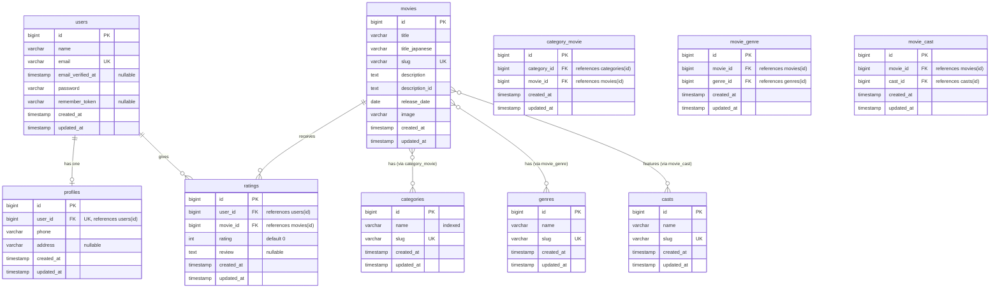

# Movie Application ERD and Schema

## Entity Relationship Diagram (ERD)

## Detailed Schema Breakdown

*   **`users` Table**
    *   `id`: BIGINT (Primary Key, Auto Increment)
    *   `name`: VARCHAR
    *   `email`: VARCHAR (Unique)
    *   `email_verified_at`: TIMESTAMP (Nullable)
    *   `password`: VARCHAR
    *   `remember_token`: VARCHAR(100) (Nullable)
    *   `created_at`: TIMESTAMP (Nullable)
    *   `updated_at`: TIMESTAMP (Nullable)

*   **`profiles` Table**
    *   `id`: BIGINT (Primary Key, Auto Increment)
    *   `user_id`: BIGINT (Unsigned, Unique, Foreign Key references `users.id`, ON DELETE CASCADE)
    *   `phone`: VARCHAR
    *   `address`: VARCHAR (Nullable)
    *   `created_at`: TIMESTAMP (Nullable)
    *   `updated_at`: TIMESTAMP (Nullable)

*   **`categories` Table**
    *   `id`: BIGINT (Primary Key, Auto Increment)
    *   `name`: VARCHAR(100) (Indexed)
    *   `slug`: VARCHAR (Unique)
    *   `created_at`: TIMESTAMP (Nullable)
    *   `updated_at`: TIMESTAMP (Nullable)

*   **`genres` Table**
    *   `id`: BIGINT (Primary Key, Auto Increment)
    *   `name`: VARCHAR
    *   `slug`: VARCHAR (Unique)
    *   `created_at`: TIMESTAMP (Nullable)
    *   `updated_at`: TIMESTAMP (Nullable)

*   **`casts` Table**
    *   `id`: BIGINT (Primary Key, Auto Increment)
    *   `name`: VARCHAR
    *   `slug`: VARCHAR (Unique)
    *   `created_at`: TIMESTAMP (Nullable)
    *   `updated_at`: TIMESTAMP (Nullable)

*   **`movies` Table**
    *   `id`: BIGINT (Primary Key, Auto Increment)
    *   `title`: VARCHAR
    *   `title_japanese`: VARCHAR
    *   `slug`: VARCHAR (Unique)
    *   `description`: TEXT
    *   `description_id`: TEXT
    *   `release_date`: DATE
    *   `image`: VARCHAR
    *   `created_at`: TIMESTAMP (Nullable)
    *   `updated_at`: TIMESTAMP (Nullable)

*   **`ratings` Table**
    *   `id`: BIGINT (Primary Key, Auto Increment)
    *   `user_id`: BIGINT (Unsigned, Foreign Key references `users.id`, ON DELETE CASCADE)
    *   `movie_id`: BIGINT (Unsigned, Foreign Key references `movies.id`, ON DELETE CASCADE)
    *   `rating`: INTEGER (Default: 0)
    *   `review`: TEXT (Nullable)
    *   `created_at`: TIMESTAMP (Nullable)
    *   `updated_at`: TIMESTAMP (Nullable)

*   **`category_movie` Table** (Pivot Table)
    *   `id`: BIGINT (Primary Key, Auto Increment)
    *   `category_id`: BIGINT (Unsigned, Foreign Key references `categories.id`, ON DELETE CASCADE)
    *   `movie_id`: BIGINT (Unsigned, Foreign Key references `movies.id`, ON DELETE CASCADE)
    *   `created_at`: TIMESTAMP (Nullable)
    *   `updated_at`: TIMESTAMP (Nullable)

*   **`movie_genre` Table** (Pivot Table)
    *   `id`: BIGINT (Primary Key, Auto Increment)
    *   `movie_id`: BIGINT (Unsigned, Foreign Key references `movies.id`, ON DELETE CASCADE)
    *   `genre_id`: BIGINT (Unsigned, Foreign Key references `genres.id`, ON DELETE CASCADE)
    *   `created_at`: TIMESTAMP (Nullable)
    *   `updated_at`: TIMESTAMP (Nullable)

*   **`movie_cast` Table** (Pivot Table)
    *   `id`: BIGINT (Primary Key, Auto Increment)
    *   `movie_id`: BIGINT (Unsigned, Foreign Key references `movies.id`, ON DELETE CASCADE)
    *   `cast_id`: BIGINT (Unsigned, Foreign Key references `casts.id`, ON DELETE CASCADE)
    *   `created_at`: TIMESTAMP (Nullable)
    *   `updated_at`: TIMESTAMP (Nullable)